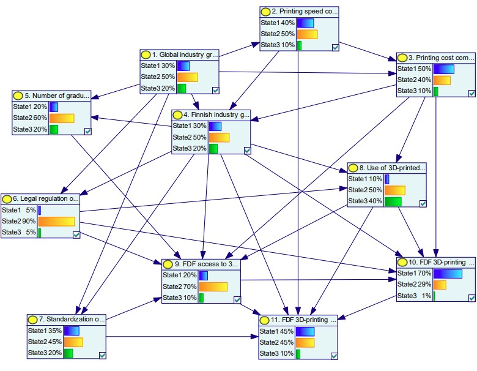

# Refining-a-probabilistic-cross-impact-methodology-for-scenario-analysis
Matlab implementation of a cross-impact methodogy for generating Bayes-networks based on expert judgments. Majority of this code is based on Juho Roponen's implementation of the original methodology here: https://github.com/juropo/cross-impact. The revised methodology used in this repository is detailed in the file ``Haapasalo_Tuomas_2025.pdf``.

### Note
**The code was developed only for this research paper and is not trivially applicable to other contexts**.

## A Generated Bayesian network using the GeNIe software
**3D printing case study for the Finnish Defence Forces (FDF)**

  >
  >

This network structure provides a visual representation of the relationships and dependencies among the uncertainty factors. This demonstrates the possible applications of our approach such as conducting ``what-if``-analysis by locking in realizations of chosen uncertainty factors and seeing how the conditional probabilities of other uncertainty factors change. The GeNIe software can be downloaded from https://www.bayesfusion.com/genie/.

## Summary

Scenario analysis is an important tool for supporting managerial decision-making. Preparing for the unexpected is increasingly relevant, as demonstrated by the unforeseen recent developments such as the COVID-19 pandemic, the conflict in Ukraine, and the Gaza war. Examining alternative futures may reveal hidden vulnerabilities or strengths. Scenario thinking breaks narrow-mindedness and helps overcome cognitive biases by bringing surprising scenarios into consideration.

The field of scenario analysis methods is broad and diverse. By and large, there are qualitative and quantitative methods, as well as combinations thereof. Another major distinction can be made between methods that utilize probabilities and those that do not. At the core of these methods are the ways of scenario construction. Examples of systematic methods that account for mutual dependencies of uncertainty factors are cross-impact analysis methodologies, in general, choosing a suitable method depends on the intended use and context. In this thesis, we examine whether a probabilistic cross-impact analysis method can be enhanced by changing the interpretation of the cross-impact term with the odds-ratio.

The applicability of the new asymmetric cross-impact term was evaluated by examining the effects of its asymmetry on the functionality of the method. The original model was modified to support the new interpretation, whereafter the distributions produced by both methods were compared using statistical and visual tests. The most important observations included the apparent similarity of the joint probability distributions for the most probable scenarios and significant differences for the remaining scenarios. Computationally, neither method was faster than the other. The conclusion is that both interpretations are viable.

## Contents

``figures/`` contains some of the produced figures of this repository. 

``green_product/`` contains the script ``green_product_example.m`` that uses cross-impacts defined in the file ``green-product_example.csv`` to produce the conditional distribution for the green product example (see Tables 1-3). 

``printing_network/`` contains the script ``printing_network.m`` that defines the node structure and runs the lsq problem using pre-defined cross-impacts that are specified in the file ``cross-impacts-3d.csv`` to obtain the conditional distributions to produce the Bayes network above. ``printing_network.xdsl`` is the Bayesian network file that can be opened using the GeNIe software.

``statistical_tests/`` contains files for running the statistical tests of section 4.2.

``utils/`` Contains all helper functions used in solving the lsq problem iteratively. The purpose of each function is specified more thoroughly in their respective files. **Note:** the two distinct approaches differ so that the original method uses the file ``ls_bayes_org.m`` to solve the lsq problem, while the revised approach uses the file ``ls_bayes_odds.m``.
